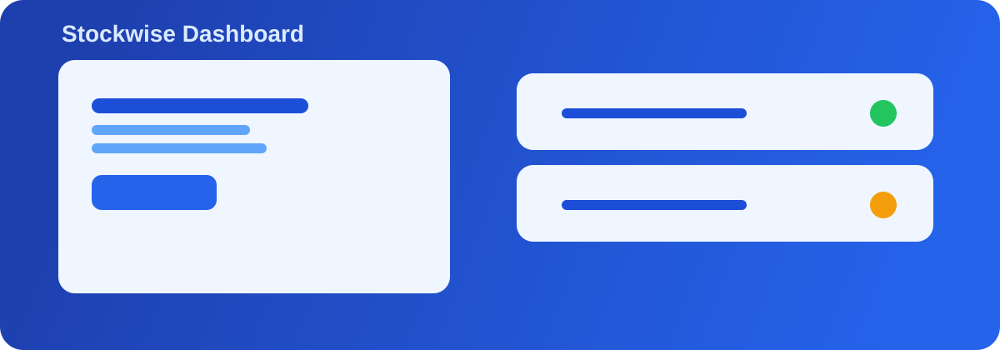

# Stockwise Dashboard

Dashboard administrativo para la Inventory API. Está construido con Angular 22, Angular Material, componentes standalone, rutas lazy-loaded y formularios reactivos.



## Funcionalidades

- Inicio de sesión con JWT, guard de autenticación e interceptor `Bearer`.
- Dashboard con métricas de catálogo y alertas de stock bajo.
- CRUD de productos y categorías para administradores.
- Registro de ventas, compras e historial de movimientos según el rol.
- Directorio paginado de usuarios para administradores.
- Perfil autenticado y registro de usuarios.
- Reporte de productos más vendidos construido con el endpoint agregado de Dapper.
- Estados de carga, mensajes de error y confirmación de eliminaciones.

## Desarrollo

```powershell
npm install
npm start
```

La aplicación se sirve en `http://localhost:4200`. Arranca primero `Inventory.Api`.

| Perfil | Comando | API configurada |
| --- | --- | --- |
| Local (predeterminado) | `npm run local` | `http://localhost:51049/api` |
| Development | `npm run dev` | `https://localhost:51048/api` |
| Production | `npm run production` | `/api` |

Los perfiles no contienen secretos: el navegador sólo necesita la URL pública de la API. Producción usa `/api` para publicar ambos servicios bajo el mismo dominio o mediante un reverse proxy.

## Integración con la API

| Área | Endpoints consumidos |
| --- | --- |
| Sesión | `POST /api/auth/login`, `POST /api/auth/register` |
| Catálogo | `GET /api/products`, `GET /api/products/{id}`, `POST /api/products`, `PUT /api/products/{id}`, `DELETE /api/products/{id}`, `GET /api/categories`, `GET /api/categories/{id}`, `POST /api/categories`, `PUT /api/categories/{id}`, `DELETE /api/categories/{id}` |
| Operación | `GET /api/purchases`, `GET /api/purchases/{id}`, `POST /api/purchases`, `GET /api/sales`, `GET /api/sales/{id}`, `POST /api/sales` |
| Analítica | `GET /api/sales/reports/top-products` |
| Cuenta | `GET /api/users/me`, `GET /api/users` |

## Recursos visuales

- `public/illustrations/auth-hero.svg` para login y registro.
- `public/illustrations/empty-state.svg` para estados vacíos.
- `public/illustrations/readme-cover.svg` para presentación del repositorio.

## Estructura

```text
src/app/
├── core/        # Autenticación, guards, interceptor, servicios y modelos
├── features/    # Pantallas por dominio: auth, dashboard, catalog, transactions, users
├── layouts/     # Shell de aplicación y navegación
└── shared/      # Componentes reutilizables
```
